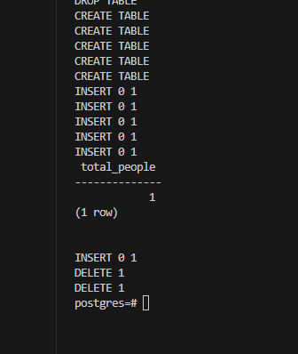
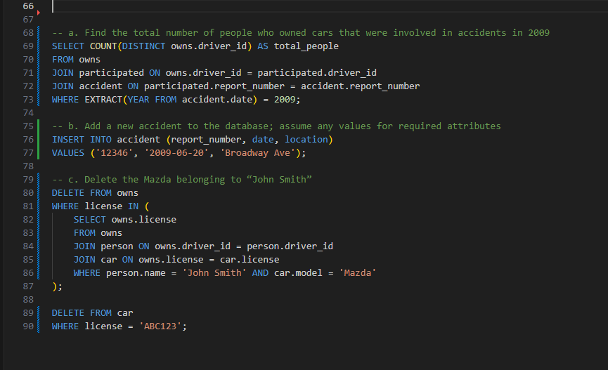

# E3.4DSC

Figure 3.18
Insurance database for Exercises 3.4 and 3.14

person (driver_id, name, address)
car (license, model, year)
accident (report_number, date, location)
owns (driver_id, license)
participated (report_number, driver_id, damage_amount)

Consider the insurance database of Figure 3.18, where the primary keys are underlined. Construct the following SQL queries for this relational database:

a. Find the total number of people who owned cars that were involved in accidents in 2009.

b. Add a new accident to the database; assume any values for required attributes.

c. Delete the Mazda belonging to “John Smith.”

